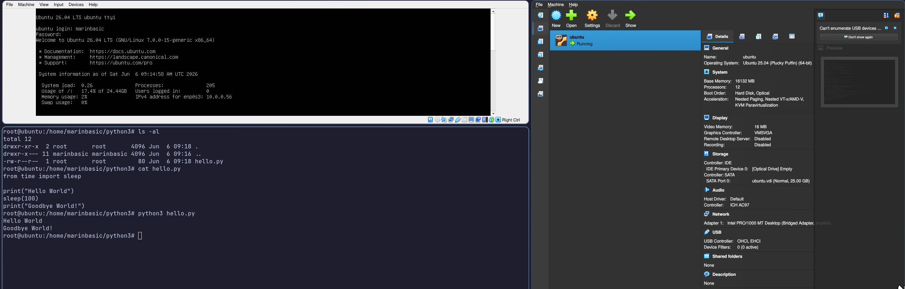
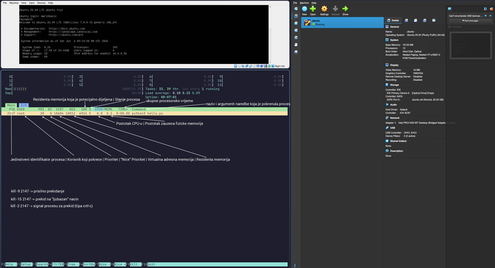
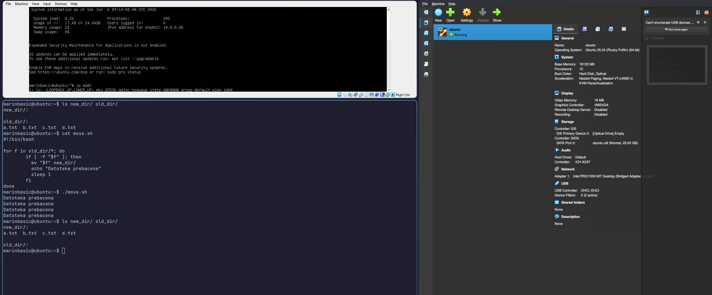
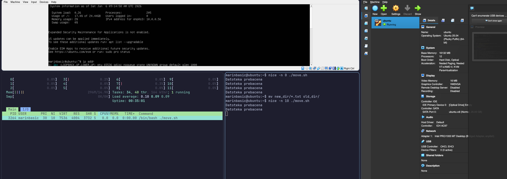
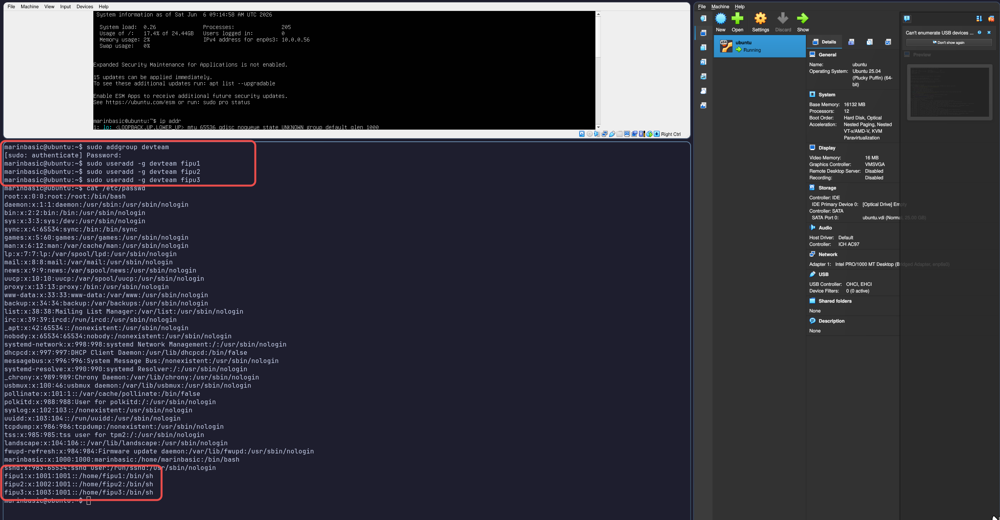
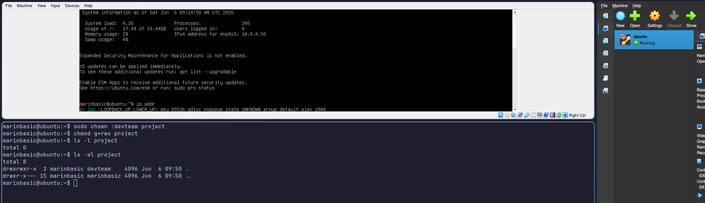
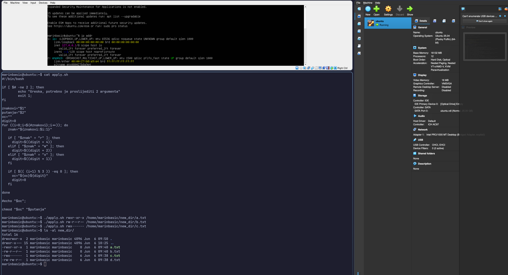

# Vjezba 5

## Zadatak 1

## Zadatak 2

## Zadatak 3 

## Zadatak 4

  | Dozvola | Kalkuacija | Oktal | Opis |
  |---|---|---|---|
  | rwxr-xr-x | rwx(4+2+1=**7**) r-x(4+0+1=**5**) r-x(4+0+1=**5**) | 755 | Vlasnik može čitati, pisati i izvršavati a grupa i ostali mogu samo čitati i izvršavati. |
  | rw-r--r-- | rw-(4+2+0=**6**) r--(4+0+0=**4**) r--(4+0+0=**4**) | 644 | Vlasnik može čitati i pisati a grupa i ostali mogu samo čitati. |
  | rwx------ | rwx(4+2+1=**7**) ---(0+0+0=**0**) ---(0+0+0=**0**) | 700 | Samo vlasnik ima sve dozvole a grupa i ostali nemaju nikakav pristup. |
  | rw-rw-r-- | rw-(4+2+0=**6**) rw-(4+2+0=**6**) r--(4+0+0=**4**) | 664 | Vlasnik i grupa mogu čitati i pisati a ostali mogu samo čitati. |
  | rwxrwxrwx | rwx(4+2+1=**7**) rwx(4+2+1=**7**) rwx(4+2+1=**7**) | 777 | Svi imaju dozvole, čitanje, pisanje i izvršavanje. |
  | r--r--r-- | r--(4+0+0=**4**) r--(4+0+0=**4**) r--(4+0+0=**4**) | 444 | Svi mogu samo čitati |
  | rw------- | rw-(4+2+0=**6**) ---(0+0+0=**0**) ---(0+0+0=**0**) | 600 | Vlasnik može čitati i pisati a grupa i ostali nemaju pristup. |

## Zadatak 5

